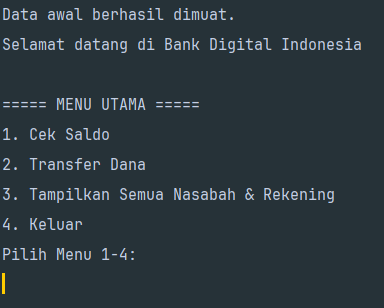
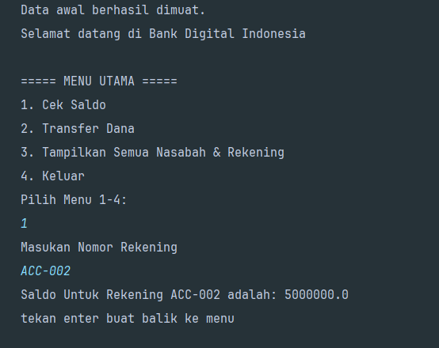
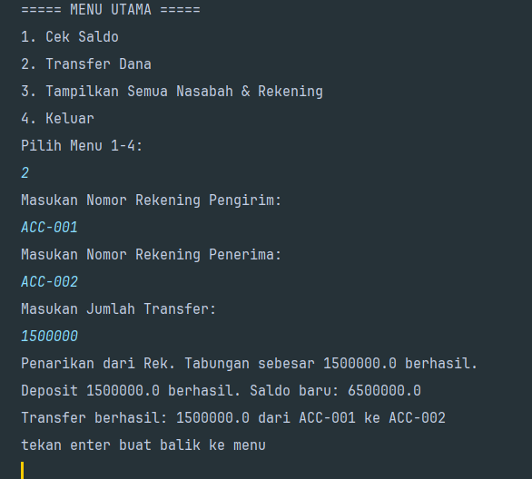
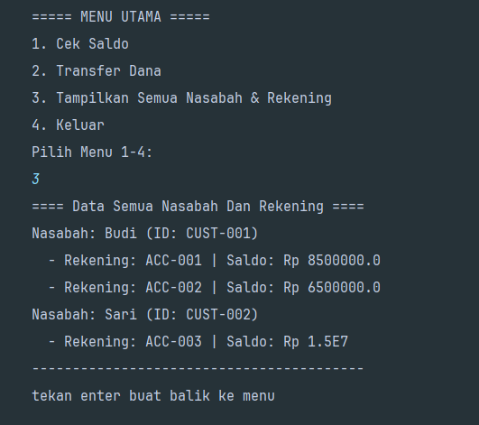

# Simulasi Bank Digital Sederhana

Sebuah proyek aplikasi konsol berbasis Java yang dirancang untuk mempraktikkan dan mendemonstrasikan prinsip-prinsip fundamental Object-Oriented Programming (OOP).

## Deskripsi Proyek

Aplikasi ini adalah sebuah Command-Line Interface (CLI) yang mensimulasikan operasi perbankan dasar. Pengguna dapat berinteraksi dengan sistem melalui menu sederhana untuk melakukan pengecekan saldo, transfer dana antar rekening, dan melihat daftar semua nasabah.

Proyek ini sengaja dibuat untuk menjadi studi kasus penerapan 4 pilar utama OOP (Encapsulation, Inheritance, Polymorphism, Abstraction) serta konsep penting lainnya seperti Komposisi Objek dan penggunaan Collections.

## Tampilan Aplikasi (Screenshots)

Berikut adalah beberapa contoh tampilan saat aplikasi dijalankan.

**1. Menu Utama Aplikasi**



**2. Cek Saldo**


**2. Contoh Alur Transfer Dana yang Sukses**


**3. Tampilan Semua Data Nasabah dan Rekening**


## Fitur Utama

- **Menu Interaktif**: Navigasi program yang mudah melalui pilihan menu di konsol.
- **Cek Saldo**: Pengguna dapat mengecek saldo rekening manapun dengan memasukkan nomor rekening.
- **Transfer Dana**: Melakukan transfer dana dari satu rekening ke rekening lain dengan validasi saldo.
- **Tampilkan Semua Data**: Menampilkan daftar semua nasabah yang terdaftar di bank beserta rekening dan saldo yang mereka miliki.
- **Data Awal**: Aplikasi secara otomatis memuat data nasabah dan rekening awal untuk kemudahan demonstrasi dan testing.

## Teknologi yang Digunakan

- **Bahasa**: Java (JDK 11 atau lebih baru)
- **Tools**: IDE (IntelliJ IDEA, Eclipse, atau VS Code)
- **Core Libraries**: Java Standard Library (`java.util.Scanner`, `java.util.List`, `java.util.ArrayList`)

## Cara Menjalankan Proyek

Untuk menjalankan proyek ini di lingkungan lokal Anda, ikuti langkah-langkah berikut:

1.  **Clone Repository** (jika sudah di-upload ke Git)
    ```bash
    git clone https://github.com/hadi-rch/bank-console-app
    cd belajar-oop
    ```
    Jika belum, cukup pastikan semua file `.java` berada dalam struktur direktori yang benar.

2.  **Buka di IDE**
    Buka proyek menggunakan IDE favorit Anda (misalnya, IntelliJ IDEA).

3.  **Pastikan Struktur Package Benar**
    Semua file Java harus berada di dalam package `oop.intro.test`. Struktur direktorinya akan terlihat seperti ini:
    ```
    src/
    └── oop/
        └── intro/
            └── test/
                ├── Account.java
                ├── Bank.java
                ├── CheckingAccount.java
                ├── Customer.java
                ├── SavingAccount.java
                ├── BankConsoleApp.java
                └── Main.java
    ```

4.  **Jalankan Aplikasi**
    Temukan file `Main.java` dan jalankan method `main()`. Aplikasi konsol interaktif akan dimulai.

## Konsep OOP yang Didemonstrasikan

Proyek ini secara aktif mengimplementasikan konsep-konsep berikut:

-   **Encapsulation**: Properti class (`balance`, `accountList`, dll.) bersifat `private` dan hanya bisa diakses melalui method publik (`getter`, `deposit()`, `withdraw()`).
-   **Inheritance**: `SavingAccount` dan `CheckingAccount` adalah turunan (`extends`) dari `Account`, mewarisi properti dan method dasar.
-   **Polymorphism**: Method `withdraw()` memiliki perilaku yang berbeda pada `SavingAccount` (tidak boleh minus) dan `CheckingAccount` (memperbolehkan *overdraft*).
-   **Abstraction**: `Account` didefinisikan sebagai `abstract class` dengan `abstract method` `withdraw()`, yang memaksa class turunan untuk menyediakan implementasi spesifik.
-   **Composition**:
    -   `Bank` "memiliki" (`has-a`) sebuah `List<Customer>`.
    -   `Customer` "memiliki" (`has-a`) sebuah `List<Account>`.
        Ini menunjukkan hubungan antar objek yang bukan merupakan warisan.

## Rencana Pengembangan Selanjutnya

-   [ ] Implementasi fitur biaya administrasi untuk setiap transfer.
-   [ ] Tambahkan menu untuk membuat nasabah dan rekening baru secara interaktif.
-   [ ] Simpan riwayat transaksi untuk setiap rekening.
-   [ ] Tambahkan penanganan error yang lebih baik (misalnya, jika pengguna memasukkan teks saat diminta angka).
-   [ ] Tulis *Unit Tests* (menggunakan JUnit) untuk memvalidasi logika bisnis di class `Bank` dan `Account`.

---